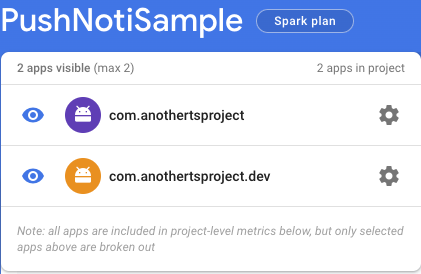

# **Project: Push Notifications**
Instructions on how to implement push notifications

## **Result Example**

## **Step 1: Install the required libraries**
We'll need this library for Android:

    > yarn add react-native-push-notification

And this for iOS: 

    > yarn add @react-native-community/push-notification-ios

### **iOS manual Installation**
Since the component uses PushNotificationIOS for the iOS part, we should follow their [installation instructions].


### **Android manual Installation**

**NOTE:** `firebase-messaging`, prior to version 15 requires to have the same version number in order to work correctly at build time and at run time. To use a specific version:

In your `android/build.gradle`

```gradle
ext {
    googlePlayServicesVersion = "+"         //Latest ver
    firebaseMessagingVersion = "23.0.0"     //Latest ver

    ...
}
```

**NOTE:** localNotification() works without changes in the application part, while localNotificationSchedule() only works with these changes:

In your `android/app/src/main/AndroidManifest.xml`

```xml
    .....
    <uses-permission android:name="android.permission.VIBRATE" />
    <uses-permission android:name="android.permission.RECEIVE_BOOT_COMPLETED"/>

    <application ....>
        <meta-data  android:name="com.dieam.reactnativepushnotification.notification_foreground"
                    android:value="false"/>
        <meta-data  android:name="com.dieam.reactnativepushnotification.notification_color"
                    android:resource="@android:color/white"/> 
        <receiver android:name="com.dieam.reactnativepushnotification.modules.RNPushNotificationActions" />
        <receiver android:name="com.dieam.reactnativepushnotification.modules.RNPushNotificationPublisher" />
        <receiver android:name="com.dieam.reactnativepushnotification.modules.RNPushNotificationBootEventReceiver">
            <intent-filter>
                <action android:name="android.intent.action.BOOT_COMPLETED" />
                <action android:name="android.intent.action.QUICKBOOT_POWERON" />
                <action android:name="com.htc.intent.action.QUICKBOOT_POWERON"/>
            </intent-filter>
        </receiver>

        <service
            android:name="com.dieam.reactnativepushnotification.modules.RNPushNotificationListenerService"
            android:exported="false" >
            <intent-filter>
                <action android:name="com.google.firebase.MESSAGING_EVENT" />
            </intent-filter>
        </service>
     .....
```

If you're not using a built in Android color (`@android:color/{name}`) for the `notification_color` `meta-data` item.

In `android/app/src/main/res/values/colors.xml` (Create the file if it doesn't exist).

```xml
<resources>
    <color name="white">#FFF</color>
</resources>
```

If your app has an @Override on onNewIntent in `MainActivity.java` ensure that function includes a super call on onNewIntent (if your `MainActivity.java` does not have an @Override for onNewIntent skip this):

```java
    @Override
    public void onNewIntent(Intent intent) {
        ...
        super.onNewIntent(intent);
        ...
    }
```

### If you use remote notifications

Make sure you have installed setup Firebase correctly.

In `android/build.gradle`

```gradle

buildscript {
    ...
    dependencies {
        ...
        classpath('com.google.gms:google-services:4.3.10')
        ...
    }
}
```

In `android/app/build.gradle`

```gradle
dependencies {
  ...
  implementation 'com.google.firebase:firebase-analytics:17.3.0'
  ...
}

apply plugin: 'com.google.gms.google-services'

```

**Note: [firebase/release-notes](https://firebase.google.com/support/release-notes/android)**

> Now, to use Analytics or any Firebase product that recommends the use of Analytics (see table below), you need to explicitly add the Analytics dependency: `com.google.firebase:firebase-analytics:17.3.0`.

Then put your `google-services.json` in `android/app/`.

**Note:** Since the project has multiple environments, pushing notifications will work differently. Therefore, you need to add every version of ApplicationSuffixId into Firebase. The application package name must match with the one in `google-services.json`

**E.g:**



### If you don't use autolink

In `android/settings.gradle`

```gradle
...
include ':react-native-push-notification'
project(':react-native-push-notification').projectDir = file('../node_modules/react-native-push-notification/android')
```

In your `android/app/build.gradle`

```gradle
 dependencies {
    ...
    implementation project(':react-native-push-notification')
    ...
 }
```

Manually register module in `MainApplication.java` (if you did not use `react-native link`):

```java
import com.dieam.reactnativepushnotification.ReactNativePushNotificationPackage;  // <--- Import Package

public class MainApplication extends Application implements ReactApplication {

  private final ReactNativeHost mReactNativeHost = new ReactNativeHost(this) {
      @Override
      protected boolean getUseDeveloperSupport() {
        return BuildConfig.DEBUG;
      }
  ...
  };

  ....
}
```

## **Step 2: Manage Channel And Implement Action**

### Channel Management (Android)

To use channels, create them at startup and pass the matching `channelId` through to `PushNotification.localNotification` or `PushNotification.localNotificationSchedule`.

```js
import PushNotification from 'react-native-push-notification';
...
 useEffect(() => {
    PushNotification.createChannel(
      {
        channelId: 'test-channel', // (required)
        channelName: 'My channel', // (required)
        channelDescription: 'A channel to categorize your notifications', // (optional) default: undefined.
        playSound: false, // (optional) default: true
        soundName: 'default', // (optional) See `soundName` parameter of `localNotification` function
        vibrate: true, // (optional) default: true. Creates the default vibration pattern if true.
      },
      (created: string) => console.log(`createChannel returned '${created}'`), // (optional) callback returns whether the channel was created, false means it already existed.
    );
  }, []);
```

**NOTE:** Without channel, notifications won't work

### Push Notification Action

```js
const handleNotification = () => {
    PushNotification.localNotification({
      channelId: 'test-channel',
      title: 'AnotherTSProject',
      message: 'OK',
      bigText: 'Notifications worked',
      color: 'red',
    });
  };
```


[//]: #Reference

[installation instructions]: https://github.com/react-native-push-notification/ios