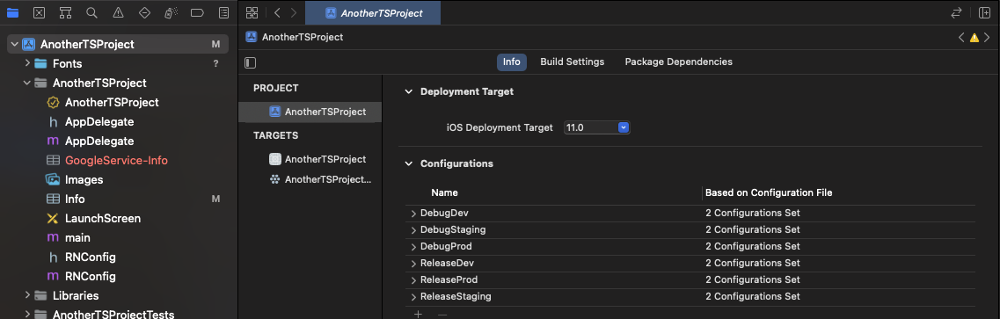
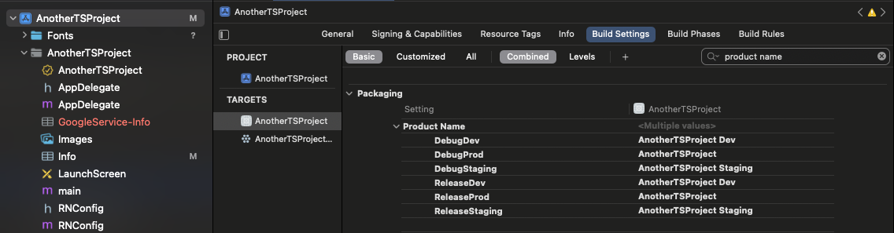
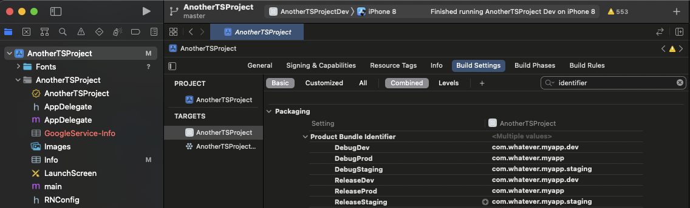
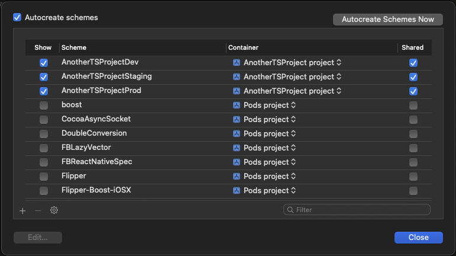
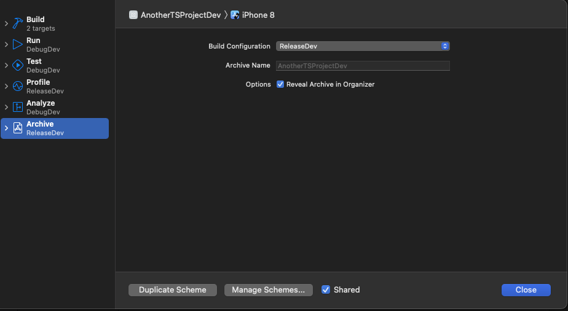
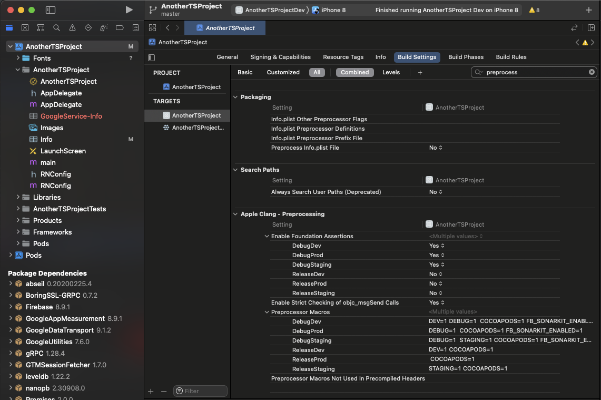

# **Project: Multi Build Environments**

## **Step 1: Create env files**

**.env**

    IS_PRODUCTION=false

**.env.production**

    IS_PRODUCTION=true

**.env.staging**

    IS_PRODUCTION=false


**envConfig.ts**
```ts
import {NativeModules} from 'react-native';

const {EnvConfig} = NativeModules;

const NAME: 'dev' | 'staging' | 'prod' = EnvConfig?.ENV || 'dev';

interface ENVModel {
  NAME: typeof NAME;
}

const ENV: ENVModel = {
  NAME,
};

export default ENV;

```

## **Step 2: Create Android Keystore**

- Step 1: Install compatible JDK and JRE (version 11 recommended)
- Step 2: Redirect into JDK folder and open up a terminal, run:

        >  sudo keytool -genkey -v -keystore my-upload-key.keystore -alias my-key-alias -keyalg RSA -keysize 2048 -validity 10000


- Step 3: Place the my-upload-key.keystore file under the android/app directory in your project folder.
- Step 4: Edit the file ~/.gradle/gradle.properties or android/gradle.properties, and add the following (replace ***** with the correct keystore password, alias and key password),

## **Step 3: Config**

### **Android**

**Step 1: Add App's ID, name and key** 

Under your project's android folder, go to `app/src/main/res/values/strings.xml`:

- Remove 

```
    <string name="app_name">MyApp</string>
```

At app-level `build.gradle`:

- Add to the top: 

```
project.ext.envConfigFiles = [
        debug: ".env",
        release: ".env", 
        staging: ".env.staging", 
]
```

- Under `signingConfigs`, add:

```java
signingConfigs {
        release {
            if (project.hasProperty('MYAPP_UPLOAD_STORE_FILE')) {
                storeFile file(MYAPP_UPLOAD_STORE_FILE)
                storePassword MYAPP_UPLOAD_STORE_PASSWORD
                keyAlias MYAPP_UPLOAD_KEY_ALIAS
                keyPassword MYAPP_UPLOAD_KEY_PASSWORD
            }
        }
        debug {
            storeFile file('debug.keystore')
            storePassword 'android'
            keyAlias 'androiddebugkey'
            keyPassword 'android'
        }
        staging {
            if (project.hasProperty('MYAPP_UPLOAD_STORE_FILE_STAGING')) {
                storeFile file(MYAPP_UPLOAD_STORE_FILE_STAGING)
                storePassword MYAPP_UPLOAD_STORE_PASSWORD_STAGING
                keyAlias MYAPP_UPLOAD_KEY_ALIAS_STAGING
                keyPassword MYAPP_UPLOAD_KEY_PASSWORD_STAGING
            }
        }
    }
    buildTypes {
        debug {
            signingConfig signingConfigs.debug
            buildConfigField "String", "ENV", '"dev"'
            resValue "string", "app_name", "AnotherTSProject Dev"
            applicationIdSuffix ".dev"

        }
        release {
            // Caution! In production, you need to generate your own keystore file.
            // see https://reactnative.dev/docs/signed-apk-android.
            signingConfig signingConfigs.release
            minifyEnabled enableProguardInReleaseBuilds
            proguardFiles getDefaultProguardFile("proguard-android.txt"), "proguard-rules.pro"
            buildConfigField "String", "ENV", '"prod"'
            resValue "string", "app_name", "AnotherTSProject Dev"
            applicationIdSuffix ".dev"

        }
        dev {
            signingConfig signingConfigs.debug
            minifyEnabled enableProguardInReleaseBuilds
            buildConfigField "String", "ENV", '"dev"'
            resValue "string", "app_name", "AnotherTSProject Dev"
            applicationIdSuffix ".dev"
        }
        //Caution: Never name the "Staging" build type as "staging" as it can cause error
        stagingRelease {
            signingConfig signingConfigs.staging
            minifyEnabled enableProguardInReleaseBuilds
            proguardFiles(getDefaultProguardFile("proguard-android.txt"), "proguard-rules.pro")
            matchingFallbacks = ['debug', 'release']
            buildConfigField "String", "ENV", '"staging"'
            resValue "string", "app_name", "AnotherTSProject Staging"
            applicationIdSuffix ".staging"
        }
        prod {
            buildConfigField "String", "ENV", '"prod"'
            resValue "string", "app_name", "AnotherTSProject"
        }
    }
```
**Step 2: Register App Modules** 

Under `app/src/main.java/com/project`:

- Create `RNConfigModule.java`

```java
package com.anothertsproject; // replace com.your-app-name with your app’s name

import com.facebook.react.bridge.ReactApplicationContext;
import com.facebook.react.bridge.ReactContextBaseJavaModule;

import java.util.Map;
import java.util.HashMap;

import com.anothertsproject.BuildConfig;


public class RNConfigModule extends ReactContextBaseJavaModule {

   RNConfigModule(ReactApplicationContext context) {
       super(context);
   }

   @Override
   public String getName() {
       return "RNConfig";
   }

   @Override
   public Map<String, Object> getConstants() {
       final Map<String, Object> constants = new HashMap<>();
       constants.put("ENV", BuildConfig.ENV);
       return constants;
   }
}
```

- Create `RNConfigPackage.java`

```java
package com.anothertsproject; // replace your-app-name with your app’s name

import com.facebook.react.ReactPackage;
import com.facebook.react.bridge.NativeModule;
import com.facebook.react.bridge.ReactApplicationContext;
import com.facebook.react.uimanager.ViewManager;

import java.util.ArrayList;
import java.util.Collections;
import java.util.List;

public class RNConfigPackage implements ReactPackage {

   @Override
   public List<ViewManager> createViewManagers(ReactApplicationContext reactContext) {
       return Collections.emptyList();
   }

   @Override
   public List<NativeModule> createNativeModules(ReactApplicationContext reactContext) {
       List<NativeModule> modules = new ArrayList<>();
       modules.add(new RNConfigModule(reactContext));
       return modules;
   }

}
```

- Add new package to `MainApplication.java`:
  
```  
    packages.add(new RNConfigPackage());
```

### **iOS**

**Step 1: Rename Bundle** 

Open `Info.plist`, replace `Bundle display name` with `${PRODUCT_NAME}`

**Step 2: Rename Config**



**Step 3: Rename Product**



**Step 4: Rename Identifier**



**Step 5: Add Schemes**



**Step 6: Change Build Config inside these Schemes**



**Step 7: Edit Podfile**

Add to the top:

``` 
project 'AnotherTSProject', {
  'DebugDev' => :debug,
  'DebugStaging' => :debug,
  'DebugProd' => :debug,
  'ReleaseDev' => :release,
  'ReleaseStaging' => :release,
  'ReleaseProd' => :release,
}
```

**Step 8: Edit Preprocess Macros**



**Step 9: Create RNConfig.h**

```
//  RCTCalendarModule.h
#import <React/RCTBridgeModule.h>
@interface RNConfig : NSObject <RCTBridgeModule>
@end
```

**Step 10: Create RNConfig.m**

```
#import "RNConfig.h"

#import <React/RCTBridge.h>
#import <React/RCTEventDispatcher.h>

@implementation RNConfig
@synthesize bridge = _bridge;

RCT_EXPORT_MODULE();

+ (BOOL)requiresMainQueueSetup
{
  return YES;
}

- (NSDictionary *)constantsToExport
{
#if DEV
  NSString *env = @"dev";
#elif STAGING
  NSString *env = @"staging";
#else
  NSString *env = @"prod";
#endif
  
  return @{ @"ENV": env };
}
@end
```

## **Step 4: Test**

In `App.ts`, add: 

```ts
import {
  NativeModules,
  Platform,
  StyleSheet,
  Text,
  TouchableOpacity,
  View,
} from 'react-native';
import React, {useEffect} from 'react';

import PushNotification from 'react-native-push-notification';
import PushNotificationIOS from '@react-native-community/push-notification-ios';

const App = () => {
  const env = NativeModules.RNConfig.ENV;

  useEffect(() => {
    if (Platform.OS === 'ios') {
      PushNotificationIOS.requestPermissions();
    } else {
      PushNotification.createChannel(
        {
          channelId: 'test-channel', // (required)
          channelName: 'My channel', // (required)
          channelDescription: 'A channel to categorize your notifications', // (optional) default: undefined.
          playSound: false, // (optional) default: true
          soundName: 'default', // (optional) See `soundName` parameter of `localNotification` function
          vibrate: true, // (optional) default: true. Creates the default vibration pattern if true.
        },
        (created: boolean) =>
          console.log(`createChannel returned '${created}'`), // (optional) callback returns whether the channel was created, false means it already existed.
      );
    }
  }, []);

  const handleNotification = () => {
    PushNotification.localNotification({
      channelId: 'test-channel',
      title: 'AnotherTSProject',
      message: 'OK',
      bigText: 'Notifications worked',
      color: 'red',
    });
  };

  return (
    <View style={styles.container}>
      <Text style={styles.text}>This is</Text>
      <TouchableOpacity onPress={handleNotification}>
        <Text style={styles.envText}>{env}</Text>
      </TouchableOpacity>
      <Text style={styles.text}>Environment</Text>
    </View>
  );
};

export default App;

const styles = StyleSheet.create({
  container: {
    flex: 1,
    justifyContent: 'center',
    alignItems: 'center',
  },
  text: {
    fontSize: 32,
  },
  envText: {
    fontSize: 48,
    fontWeight: 'bold',
    color: 'red',
  },
});
```

# **Result**


